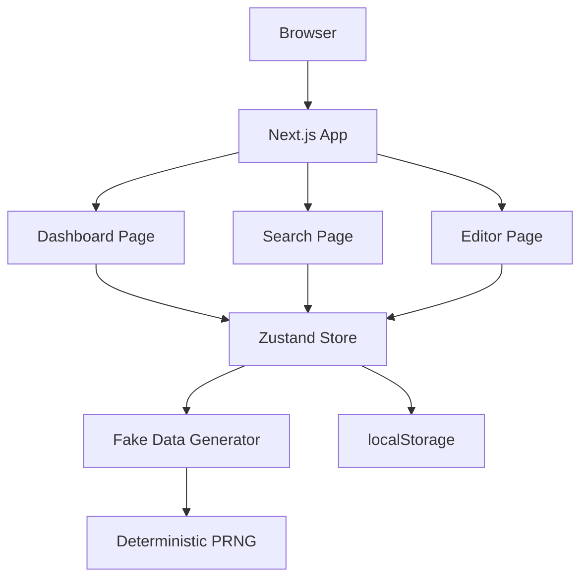
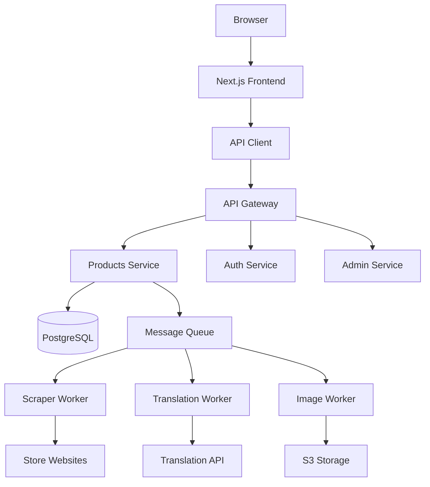
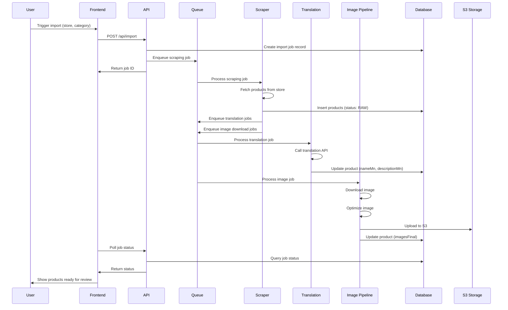
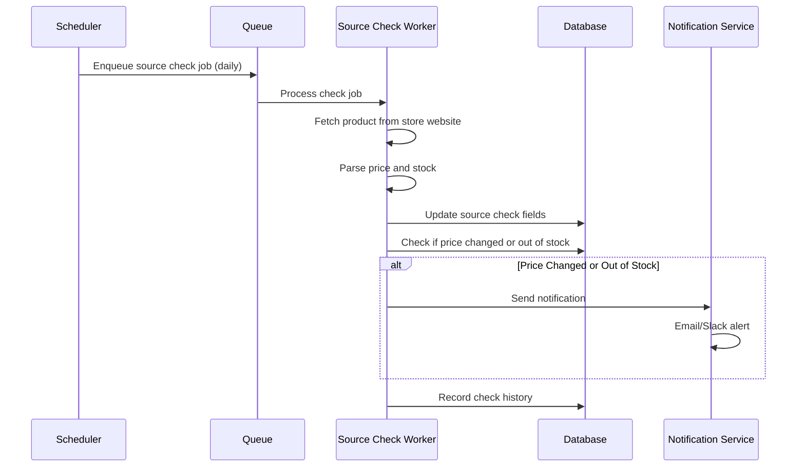
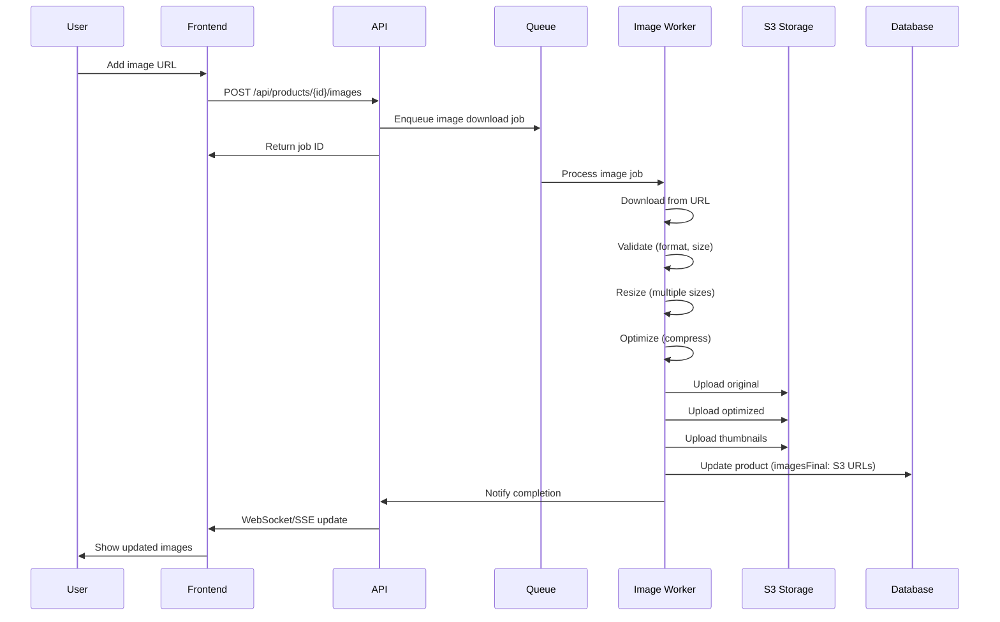

# Architecture

System architecture for both MVP (current) and production (future).

## Table of Contents

- [Current Architecture (MVP)](#current-architecture-mvp)
- [Production Architecture](#production-architecture)
- [Component Diagram](#component-diagram)
- [Data Flow](#data-flow)
- [Sequence Diagrams](#sequence-diagrams)

---

## Current Architecture (MVP)

### Overview

**Type:** UI-only Single Page Application  
**Framework:** Next.js 14 (App Router)  
**State Management:** Zustand with localStorage persistence  
**Data Source:** Fake/deterministic data generator  
**Deployment:** Static export or Vercel

### Technology Stack

```
Frontend:
├── Next.js 14 (App Router)
├── React 18
├── TypeScript
├── Tailwind CSS
├── shadcn/ui (Radix UI components)
└── Zustand (state management)

Persistence:
└── localStorage (browser)

Data:
└── Fake data generator (deterministic)
```

### Architecture Diagram

```
┌─────────────────────────────────────────┐
│         Browser (Client)                 │
│                                          │
│  ┌──────────────────────────────────┐   │
│  │     Next.js App (React)          │   │
│  │                                   │   │
│  │  ┌──────────┐  ┌──────────────┐  │   │
│  │  │  Pages   │  │  Components  │  │   │
│  │  │          │  │  (shadcn/ui) │  │   │
│  │  └────┬─────┘  └──────┬───────┘  │   │
│  │       │                │          │   │
│  │  ┌────▼────────────────▼──────┐  │   │
│  │  │    Zustand Store            │  │   │
│  │  │  (Product state + actions)  │  │   │
│  │  └────┬───────────────────────┘  │   │
│  │       │                            │   │
│  │  ┌────▼────────┐  ┌─────────────┐ │   │
│  │  │ Fake Data   │  │ Deterministic│ │   │
│  │  │ Generator   │  │ PRNG (source)│ │   │
│  │  └─────────────┘  └─────────────┘ │   │
│  └───────────────────────────────────┘   │
│              │                             │
│              ▼                             │
│  ┌──────────────────────────────────┐    │
│  │      localStorage                 │    │
│  │  (product-import-store-v2)        │    │
│  └──────────────────────────────────┘    │
└──────────────────────────────────────────┘
```

### Key Components

#### 1. Pages (Routes)

- `/import` - Dashboard
- `/import/new` - Search and Results
- `/import/new/[id]` - Product Editor

**File Structure:**
```
app/
├── import/
│   ├── page.tsx              # Dashboard
│   └── new/
│       ├── page.tsx           # Search + Results
│       └── [id]/
│           └── page.tsx       # Editor
```

#### 2. State Management

**Store:** `lib/store.ts`

**State:**
- `products`: All imported products
- `currentSearchResults`: Current search results
- `searchParams`: Last search parameters

**Actions:**
- `searchProducts()`: Generate fake products
- `updateProduct()`: Update product fields
- `updateProductStatus()`: Change status
- `validateProduct()`: Validate product
- `toggleVisibility()`: Toggle visibility
- `runSourceCheckForPushedProducts()`: Simulate source check

#### 3. Data Generation

**Fake Data:** `lib/fake-data.ts`
- Deterministic seeded random generator
- Same inputs = same outputs
- Realistic imperfections for testing

**Source Check Simulation:** `lib/deterministic-prng.ts`
- Day-based seeding
- Simulates price changes and stock status

---

## Production Architecture

### Overview

**Type:** Full-stack application with microservices  
**Frontend:** Next.js (SSR/SSG)  
**Backend:** REST API (Node.js/Python)  
**Database:** PostgreSQL  
**Storage:** S3 (images)  
**Queue:** Kafka/RabbitMQ/Redis  
**Workers:** Scraping, Translation, Image Processing

### High-Level Architecture

```
┌─────────────────────────────────────────────────────────────┐
│                    Client (Browser)                         │
│  ┌──────────────────────────────────────────────────────┐   │
│  │         Next.js Frontend (SSR/SSG)                  │   │
│  │  - Dashboard, Editor, Search                        │   │
│  │  - Auth (NextAuth.js)                               │   │
│  └──────────────┬───────────────────────────────────────┘   │
└─────────────────┼───────────────────────────────────────────┘
                  │ HTTPS
┌─────────────────▼───────────────────────────────────────────┐
│              API Gateway / Load Balancer                    │
└─────────────────┬───────────────────────────────────────────┘
                  │
    ┌─────────────┼─────────────┐
    │             │             │
┌───▼────┐  ┌────▼────┐  ┌─────▼─────┐
│  API   │  │  Auth   │  │  Admin    │
│ Server │  │ Service │  │  Service  │
└───┬────┘  └─────────┘  └───────────┘
    │
    ├─────────────────────────────────────┐
    │                                     │
┌───▼──────┐  ┌──────────┐  ┌──────────┐ │
│Products  │  │  Drafts  │  │  Users   │ │
│Service   │  │ Service  │  │ Service  │ │
└───┬──────┘  └──────────┘  └──────────┘ │
    │                                     │
┌───▼─────────────────────────────────────▼───┐
│         PostgreSQL Database                  │
│  - products, drafts, users, audit_logs         │
└──────────────────────────────────────────────┘

┌───────────────────────────────────────────────┐
│           Background Workers                  │
│                                               │
│  ┌──────────┐  ┌──────────┐  ┌──────────┐    │
│  │ Scraper  │  │Translation│ │  Image  │    │
│  │ Service  │  │  Service  │  │Pipeline │    │
│  └────┬─────┘  └────┬─────┘  └────┬────┘    │
│       │             │              │         │
│  ┌────▼─────────────▼──────────────▼─────┐  │
│  │         Message Queue (Kafka)         │  │
│  └───────────────────────────────────────┘  │
└──────────────────────────────────────────────┘

┌───────────────────────────────────────────────┐
│              External Services                │
│                                               │
│  ┌──────────┐  ┌──────────┐  ┌──────────┐  │
│  │  Store   │  │Translation│  │ Currency │  │
│  │ Websites │  │   API     │  │   API    │  │
│  └──────────┘  └───────────┘  └──────────┘  │
└──────────────────────────────────────────────┘

┌───────────────────────────────────────────────┐
│              Storage (S3)                     │
│  - Product images                             │
│  - Processed/optimized images                 │
└───────────────────────────────────────────────┘
```

### Component Details

#### 1. Frontend (Next.js)

**Responsibilities:**
- UI rendering (SSR/SSG)
- Client-side routing
- Form handling and validation
- Real-time updates (WebSocket or polling)

**Authentication:**
- NextAuth.js or similar
- JWT tokens
- Role-based access control (RBAC)

#### 2. API Server

**Technology:** Node.js (Express/Fastify) or Python (FastAPI)

**Endpoints:**
- `/api/products` - CRUD operations
- `/api/drafts` - Draft management
- `/api/import` - Import job triggers
- `/api/source-check` - Source check triggers
- `/api/auth` - Authentication

**See:** [API_CONTRACT.md](./API_CONTRACT.md) for detailed specs

#### 3. Database (PostgreSQL)

**Tables:**
- `products` - Main product data
- `product_drafts` - Draft history (optional)
- `users` - User accounts
- `source_check_history` - Check history (optional)
- `audit_logs` - Action logs

**See:** [DATA_MODEL.md](./DATA_MODEL.md) for schema

#### 4. Scraper Service

**Technology:** Python (Scrapy/Playwright) or Node.js (Puppeteer)

**Responsibilities:**
- Fetch products from store websites
- Parse HTML/JSON responses
- Extract product data
- Handle rate limiting and retries

**Deployment:**
- Containerized (Docker)
- Scheduled via cron or queue
- Distributed for scale

#### 5. Translation Service

**Technology:** Python or Node.js

**Responsibilities:**
- Call translation API (Google Translate, DeepL, Vertex AI)
- Translate product names and descriptions
- Handle rate limits and retries
- Cache translations

**APIs:**
- Google Cloud Translation API
- DeepL API
- Vertex AI Translation

#### 6. Image Pipeline

**Technology:** Python or Node.js

**Responsibilities:**
- Download images from source URLs
- Validate image format and size
- Resize and optimize images
- Upload to S3
- Generate thumbnails

**Storage:**
- S3 buckets (original, optimized, thumbnails)
- CDN for delivery (CloudFront)

#### 7. Currency Service

**Technology:** Node.js or Python

**Responsibilities:**
- Fetch exchange rates (KRW → MNT)
- Cache rates (update daily)
- Calculate converted prices
- Handle API failures gracefully

**APIs:**
- ExchangeRate-API
- Fixer.io
- Central bank APIs

#### 8. Message Queue

**Technology:** Kafka, RabbitMQ, or Redis Queue

**Use Cases:**
- Import job requests
- Translation jobs
- Image processing jobs
- Source check jobs
- Email notifications

---

## Component Diagram

### MVP Components



### Production Components



---

## Data Flow

### Import Flow (Production)



### Source Check Flow (Production)



### Image Upload Pipeline (Production)



---

## Technology Recommendations

### Backend

**Option 1: Node.js**
- Express or Fastify
- TypeScript
- Prisma ORM
- Pros: Same language as frontend, easy sharing of types

**Option 2: Python**
- FastAPI
- SQLAlchemy ORM
- Pros: Better for scraping (Scrapy), ML/AI integration

### Database

**PostgreSQL**
- JSONB for flexible fields
- Full-text search
- ACID compliance
- Extensions: pg_trgm, postgis

### Queue

**Option 1: Kafka**
- High throughput
- Event streaming
- Complex setup

**Option 2: RabbitMQ**
- Simpler setup
- Good for job queues
- Reliable

**Option 3: Redis Queue**
- Simple
- Fast
- Good for small scale

### Storage

**AWS S3**
- Durable
- Scalable
- CDN integration (CloudFront)

**Alternative:** Google Cloud Storage, Azure Blob Storage

### Monitoring

- **Logs:** CloudWatch, Datadog, or ELK
- **Metrics:** Prometheus + Grafana
- **Tracing:** Jaeger or Zipkin
- **APM:** New Relic or Datadog

---

## File Reference

- Current Store: `lib/store.ts`
- Fake Data: `lib/fake-data.ts`
- Source Check: `lib/deterministic-prng.ts`

