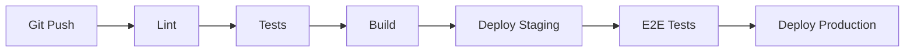

# Operations

Deployment, monitoring, maintenance, and operational procedures.

## Table of Contents

- [Deployment](#deployment)
- [CI/CD](#cicd)
- [Monitoring](#monitoring)
- [Alerting](#alerting)
- [Database Backups](#database-backups)
- [Job Management](#job-management)
- [Scaling](#scaling)
- [Disaster Recovery](#disaster-recovery)

---

## Deployment

### Current (MVP)

**Deployment:** Static export or Vercel

```bash
npm run build
# Deploy to Vercel or static hosting
```

### Production Deployment

#### Frontend (Next.js)

**Option 1: Vercel (Recommended)**
- Automatic deployments from Git
- Edge network
- Built-in analytics
- Zero configuration

**Option 2: AWS (S3 + CloudFront)**
- Build static export
- Upload to S3
- CloudFront CDN
- Custom domain

**Option 3: Docker**
```dockerfile
FROM node:18-alpine
WORKDIR /app
COPY package*.json ./
RUN npm ci
COPY . .
RUN npm run build
EXPOSE 3000
CMD ["npm", "start"]
```

#### Backend (API Server)

**Option 1: AWS ECS/Fargate**
- Containerized deployment
- Auto-scaling
- Load balancing

**Option 2: AWS Lambda (Serverless)**
- API Gateway + Lambda
- Pay per request
- Auto-scaling

**Option 3: Kubernetes**
- Container orchestration
- Self-managed or EKS
- High availability

#### Database

**PostgreSQL Options:**
- AWS RDS (managed)
- Google Cloud SQL
- Self-managed (EC2)

**Recommendation:** Managed service (RDS) for reliability.

### Deployment Process

1. **Pre-Deployment**
   - Run tests
   - Build artifacts
   - Run migrations
   - Health checks

2. **Deployment**
   - Blue-green deployment
   - Canary releases
   - Rollback capability

3. **Post-Deployment**
   - Smoke tests
   - Monitor metrics
   - Verify functionality

---

## CI/CD

### Pipeline Stages



### GitHub Actions Example

```yaml
name: CI/CD

on:
  push:
    branches: [main]
  pull_request:
    branches: [main]

jobs:
  test:
    runs-on: ubuntu-latest
    steps:
      - uses: actions/checkout@v3
      - uses: actions/setup-node@v3
        with:
          node-version: '18'
      - run: npm ci
      - run: npm run lint
      - run: npm run test
      - run: npm run build

  deploy:
    needs: test
    runs-on: ubuntu-latest
    if: github.ref == 'refs/heads/main'
    steps:
      - uses: actions/checkout@v3
      - uses: vercel/action@v20
        with:
          vercel-token: ${{ secrets.VERCEL_TOKEN }}
          vercel-org-id: ${{ secrets.ORG_ID }}
          vercel-project-id: ${{ secrets.PROJECT_ID }}
```

### Checks

- **Linting:** ESLint
- **Type Checking:** TypeScript
- **Unit Tests:** Jest/Vitest
- **E2E Tests:** Playwright
- **Security:** Snyk/Dependabot

---

## Monitoring

### Metrics to Track

#### Application Metrics

1. **API Performance**
   - Request rate (RPS)
   - Response time (p50, p95, p99)
   - Error rate
   - Endpoint-specific metrics

2. **Database Metrics**
   - Query performance
   - Connection pool usage
   - Slow queries
   - Replication lag

3. **Job Metrics**
   - Job queue length
   - Job processing time
   - Job success/failure rate
   - Worker utilization

4. **Business Metrics**
   - Products imported per day
   - Products pushed per day
   - Average review time
   - Source check success rate

#### Infrastructure Metrics

- CPU usage
- Memory usage
- Disk I/O
- Network traffic
- Container metrics

### Monitoring Tools

**Option 1: Datadog**
- Full-stack monitoring
- APM, logs, metrics
- Custom dashboards
- Alerting

**Option 2: AWS CloudWatch**
- Native AWS integration
- Logs and metrics
- Custom dashboards
- Cost-effective

**Option 3: Prometheus + Grafana**
- Open source
- Self-hosted
- Highly customizable
- Requires setup

### Dashboard Examples

**API Dashboard:**
- Request rate (line chart)
- Response time (histogram)
- Error rate (line chart)
- Top endpoints (table)

**Business Dashboard:**
- Products by status (pie chart)
- Import jobs (timeline)
- Source check results (bar chart)
- User activity (heatmap)

---

## Alerting

### Alert Rules

#### Critical Alerts (Page On-Call)

1. **Service Down**
   - API unavailable > 1 minute
   - Database connection failure
   - Frontend deployment failure

2. **High Error Rate**
   - Error rate > 5% for 5 minutes
   - 500 errors > 10/min

3. **Data Loss**
   - Database replication failure
   - Backup failure

#### Warning Alerts (Email/Slack)

1. **Performance Degradation**
   - p95 response time > 1s for 10 minutes
   - Database slow queries > 100ms

2. **Resource Exhaustion**
   - CPU > 80% for 15 minutes
   - Memory > 90%
   - Disk > 85%

3. **Job Failures**
   - Import job failure rate > 10%
   - Translation job queue > 1000

### Alert Channels

- **PagerDuty:** Critical alerts
- **Slack:** Warnings and notifications
- **Email:** Daily summaries
- **SMS:** Critical only (opt-in)

### Alert Example

```yaml
# Prometheus Alert Rule
groups:
  - name: api_alerts
    rules:
      - alert: HighErrorRate
        expr: rate(http_requests_total{status=~"5.."}[5m]) > 0.05
        for: 5m
        annotations:
          summary: "High error rate detected"
          description: "Error rate is {{ $value }}"
```

---

## Database Backups

### Backup Strategy

1. **Automated Backups**
   - Daily full backups
   - Retained for 30 days
   - Weekly backups retained for 1 year

2. **Point-in-Time Recovery**
   - Transaction log backups
   - 7-day retention
   - Restore to any point

3. **Backup Testing**
   - Monthly restore tests
   - Verify data integrity
   - Document restore procedures

### Backup Implementation

**AWS RDS:**
- Automated backups enabled
- Backup window: 03:00 UTC
- Retention: 30 days
- Cross-region replication

**Manual Backup:**
```bash
pg_dump -h hostname -U username -d database > backup.sql
```

### Restore Procedure

1. **Identify Backup**
   - Check backup availability
   - Select restore point

2. **Restore Database**
   ```bash
   psql -h hostname -U username -d database < backup.sql
   ```

3. **Verify Data**
   - Check record counts
   - Verify critical data
   - Run smoke tests

---

## Job Management

### Job Queue

**Technology:** Kafka, RabbitMQ, or Redis Queue

**Job Types:**
- Import jobs
- Translation jobs
- Image processing jobs
- Source check jobs

### Job Monitoring

1. **Queue Length**
   - Monitor queue depth
   - Alert if > 1000 jobs

2. **Job Status**
   - Pending, processing, completed, failed
   - Track processing time
   - Identify stuck jobs

3. **Worker Health**
   - Worker availability
   - Processing rate
   - Error rate

### Retry Strategy

**Exponential Backoff:**
- Initial delay: 1 second
- Max delay: 60 seconds
- Max retries: 5
- Dead letter queue after max retries

**Implementation:**
```typescript
async function processJob(job: Job) {
  try {
    await executeJob(job)
  } catch (error) {
    if (job.retryCount < MAX_RETRIES) {
      const delay = Math.min(1000 * Math.pow(2, job.retryCount), 60000)
      await scheduleRetry(job, delay)
    } else {
      await sendToDeadLetterQueue(job)
    }
  }
}
```

### Dead Letter Queue

**Purpose:** Handle permanently failed jobs

**Actions:**
- Log error details
- Notify administrators
- Manual review and retry
- Archive after 30 days

---

## Scaling

### Horizontal Scaling

**Frontend:**
- CDN caching
- Multiple instances behind load balancer
- Stateless design

**Backend:**
- Auto-scaling based on CPU/memory
- Load balancer distribution
- Stateless API design

**Workers:**
- Scale based on queue length
- Add workers during peak hours
- Remove workers during low activity

### Vertical Scaling

**Database:**
- Increase instance size
- Add read replicas
- Partition large tables

**Cache:**
- Redis cluster
- Memcached cluster

### Auto-Scaling Configuration

**AWS ECS:**
```json
{
  "minCapacity": 2,
  "maxCapacity": 10,
  "targetTrackingScalingPolicies": [
    {
      "targetValue": 70.0,
      "predefinedMetricSpecification": {
        "predefinedMetricType": "ECSServiceAverageCPUUtilization"
      }
    }
  ]
}
```

---

## Disaster Recovery

### RTO/RPO

- **RTO (Recovery Time Objective):** 4 hours
- **RPO (Recovery Point Objective):** 1 hour

### Backup Locations

- **Primary:** Same region
- **Secondary:** Different region
- **Tertiary:** Off-site (S3 Glacier)

### Recovery Procedures

1. **Database Failure**
   - Failover to replica
   - Restore from backup if needed
   - Verify data integrity

2. **Application Failure**
   - Deploy to backup region
   - Update DNS
   - Verify functionality

3. **Data Center Outage**
   - Activate DR site
   - Restore from backups
   - Communicate to users

### DR Testing

- **Frequency:** Quarterly
- **Scope:** Full system restore
- **Documentation:** Update procedures based on test results

---

## Maintenance Windows

### Scheduled Maintenance

- **Frequency:** Monthly
- **Duration:** 2 hours
- **Time:** Sunday 02:00-04:00 UTC
- **Notifications:** 1 week advance notice

### Maintenance Tasks

- Database optimization
- Index rebuilding
- Log rotation
- Security updates
- Performance tuning

---

## File Reference

- Current Build: `package.json` - scripts
- Deployment: Vercel or static hosting

