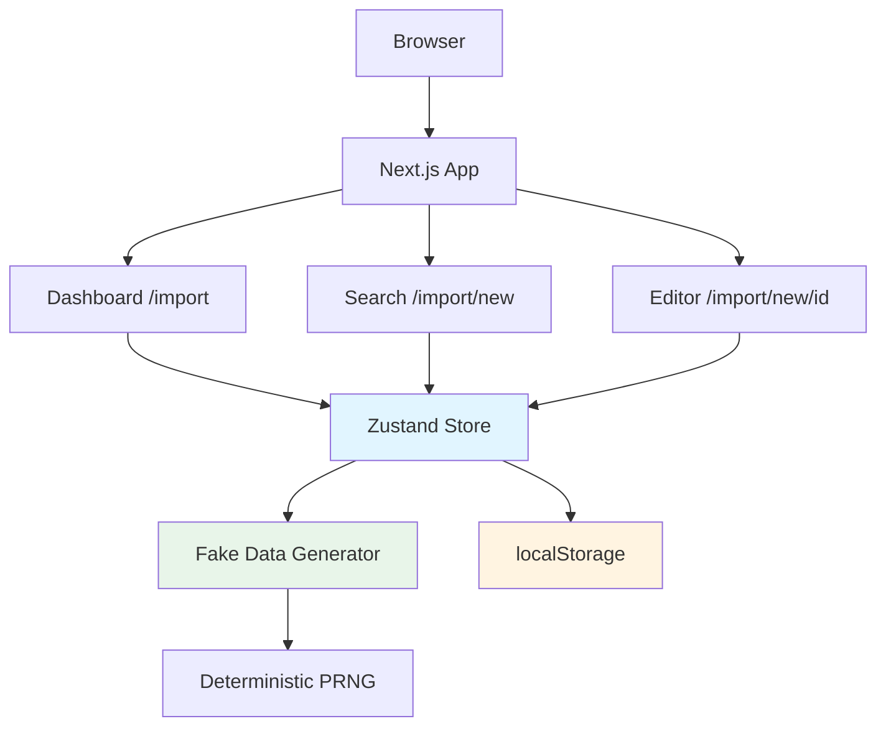
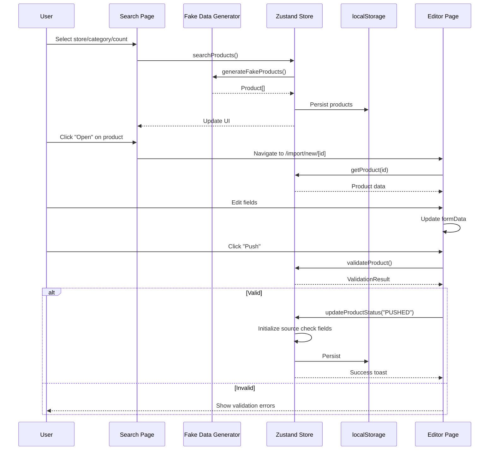
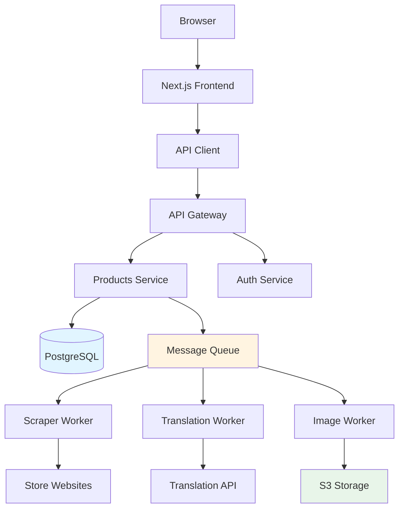

# Production-Ready Blueprint

Complete technical documentation for Product Import Tool - from UI-only MVP to production system.

**Last Updated:** 2024  
**Status:** UI-only MVP (v1.0)  
**Target:** Production-ready system

---

## Table of Contents

1. [Product Overview](#1-product-overview)
2. [How to Run Locally](#2-how-to-run-locally)
3. [UI/UX Architecture](#3-uiux-architecture)
4. [Data Model (Current)](#4-data-model-current)
5. [Data Layer (State Management)](#5-data-layer-state-management)
6. [End-to-End User Flows](#6-end-to-end-user-flows)
7. [Production-Ready Roadmap](#7-production-ready-roadmap)
8. [Known Risks / Tech Debt](#8-known-risks--tech-debt)
9. [Appendix](#9-appendix)

---

## 1. Product Overview

### What This Application Is

**Product Import Tool** - A UI-only MVP for importing, reviewing, and managing products from Korean e-commerce stores (Gmarket, Olive Young, Auction) for a Mongolian marketplace.

**Purpose:** Validate UX flows and design before building backend infrastructure.

**Current State:** UI-only with fake/local data, no backend, no real APIs.

### Key Features

- **Dashboard**: Overview of imported products with status summary
- **Product Search**: Search products by store, category, and count (fake data)
- **Product Editor**: Edit product details with validation
- **Status Workflow**: RAW → DRAFT → READY → PUSHED lifecycle
- **Bulk Actions**: Select and process multiple products
- **Source Monitoring**: Simulate checking original stores for price/stock changes
- **Visibility Control**: Hide/unhide products from public access

### Roles

**Current (MVP):** Single role - Admin/Reviewer (no authentication)  
**Production:** Will need Admin and Reviewer roles with RBAC

### Supported Flows

1. **Import Flow**: Search → Review → Edit → Push
2. **Edit Flow**: Open product → Edit fields → Save/Mark Ready/Push
3. **Bulk Flow**: Select multiple → Bulk save/push
4. **Monitor Flow**: Check source updates → Review changes → Take action

---

## 2. How to Run Locally

### Prerequisites

- Node.js 18+ 
- npm (package manager)

### Installation

```bash
# Install dependencies
npm install

# Run development server
npm run dev

# Build for production
npm run build

# Start production server
npm start

# Type check
npx tsc --noEmit

# Lint
npm run lint
```

### Development Server

**Command:** `npm run dev`  
**URL:** http://localhost:3000  
**Hot Reload:** Enabled

### Environment Variables

**Current (MVP):** None required  
**Production:** Will need:
- `DATABASE_URL` - PostgreSQL connection string
- `JWT_SECRET` - Secret for token signing
- `API_BASE_URL` - Backend API URL
- `S3_BUCKET` - Image storage bucket
- `TRANSLATION_API_KEY` - Translation service key
- `CURRENCY_API_KEY` - Currency conversion API key

### Demo Data

**Current:** Fake data is generated on-demand when searching  
**How it works:**
- Select store + category + count
- Click "Search"
- Deterministic fake products generated (same inputs = same outputs)
- Products persist to localStorage

**Reset Data:**
```javascript
// In browser console:
localStorage.removeItem('product-import-store-v2')
// Refresh page
```

**Seed Data:** No seed script needed - data generated on search

---

## 3. UI/UX Architecture

### Layout Hierarchy

**File:** `app/layout.tsx`

```
RootLayout
├── <html>
│   └── <body>
│       ├── {children} (page content)
│       └── <Toaster /> (toast notifications)
```

**No AppShell/Header/Footer:** Minimal layout, pages handle their own navigation

### Reusable UI Patterns

#### Loading States

**Component:** `components/product-card-skeleton.tsx`  
**Usage:** Shown during product search (800-1200ms delay)

```tsx
<ProductCardSkeleton />
```

**Pattern:** Skeleton components match final layout

#### Empty States

**Pattern:** Card with icon, message, and CTA button

**Example (Dashboard):**
```tsx
<div className="text-center py-8 text-muted-foreground">
  <Package className="h-12 w-12 mx-auto mb-4 opacity-50" />
  <p>No products in database yet</p>
  <Button variant="outline">Import Products</Button>
</div>
```

**File References:**
- `app/import/page.tsx:235-243` - Empty state for no pushed products
- `app/import/new/page.tsx:420-428` - Empty state for no search results

#### Error States

**Pattern:** Toast notifications for errors

**Implementation:** `hooks/use-toast.ts`

**Usage:**
```tsx
toast({
  title: "Error",
  description: "Failed to search products",
  variant: "destructive",
})
```

#### Dialogs

**Component:** `components/ui/dialog.tsx` (shadcn/ui)

**Used For:**
- Unsaved changes confirmation (`app/import/new/[id]/page.tsx:512-538`)
- Add image URL (`app/import/new/[id]/page.tsx:540-570`)

#### Toasts

**Component:** `components/ui/toaster.tsx`  
**Hook:** `hooks/use-toast.ts`

**Auto-dismiss:** 5 seconds (configured in `hooks/use-toast.ts:8`)

### Navigation Structure

**No traditional menu/navbar** - Pages use:
- Link buttons for navigation
- Breadcrumb-style back buttons
- Direct route navigation

**Routes:**
- `/` → Redirects to `/import`
- `/import` → Dashboard
- `/import/new` → Search + Results
- `/import/new/[id]` → Product Editor

### UI Components Library

**Source:** shadcn/ui (Radix UI primitives)

**Components Used:**
- `Button` - `components/ui/button.tsx`
- `Card` - `components/ui/card.tsx`
- `Input` - `components/ui/input.tsx`
- `Select` - `components/ui/select.tsx`
- `Dialog` - `components/ui/dialog.tsx`
- `Toast` - `components/ui/toast.tsx`
- `Table` - `components/ui/table.tsx`
- `Badge` - `components/ui/badge.tsx`
- `Checkbox` - `components/ui/checkbox.tsx`
- `Tooltip` - `components/ui/tooltip.tsx`
- `Skeleton` - `components/ui/skeleton.tsx`

**Styling:** Tailwind CSS with custom theme (`app/globals.css`)

---

## 4. Data Model (Current)

### Core Types

**File:** `types/product.ts`

#### Product

```typescript
interface Product {
  // Identity
  id: string                    // Format: "{store}-{category}-{index}"
  sourceStore: Store            // "gmarket" | "oliveyoung" | "auction"
  category: Category            // String (varies by store)
  sourceUrl: string            // Generated URL
  
  // Names & Descriptions
  nameOriginal: string          // Original (English/Korean)
  nameMn: string               // Mongolian (editable, required)
  descriptionOriginal: string   // Original (English/Korean)
  descriptionMn: string        // Mongolian (editable, required)
  brand?: string               // Optional
  
  // Pricing
  priceKrw: number             // Korean Won (baseline)
  priceMnt: number             // Mongolian Tugrik (editable, required)
  
  // Images
  imagesOriginal: string[]      // Original URLs from source
  imagesFinal: string[]        // Final URLs (editable, required, min 1)
  
  // Status & Lifecycle
  status: ProductStatus         // "RAW" | "DRAFT" | "READY" | "PUSHED"
  createdAt: string            // ISO 8601 timestamp
  visibility: Visibility       // "public" | "hidden"
  
  // Source Change Detection
  sourceBaselinePriceKrw?: number
  sourceLastCheckedPriceKrw?: number
  sourceLastCheckedInStock?: boolean
  sourceLastCheckedAt?: string
  sourcePriceChanged?: boolean
  sourceOutOfStock?: boolean
}
```

**Required Fields:**
- `nameMn` (non-empty)
- `descriptionMn` (non-empty)
- `priceMnt` (> 0)
- `imagesFinal` (length > 0)

**Optional Fields:**
- `brand`
- All source check fields (initialized on push)

#### Store

```typescript
type Store = "gmarket" | "oliveyoung" | "auction"
```

#### Category

**File:** `types/product.ts:52-56`

```typescript
const STORE_CATEGORIES: Record<Store, Category[]> = {
  gmarket: ["Skincare", "Makeup", "Haircare", "Fragrance", "Health"],
  oliveyoung: ["Skincare", "Makeup", "Haircare", "Body Care", "Men's Care"],
  auction: ["Electronics", "Fashion", "Home", "Beauty", "Sports"],
}
```

#### ProductStatus

```typescript
type ProductStatus = "RAW" | "DRAFT" | "READY" | "PUSHED"
```

#### Visibility

```typescript
type Visibility = "public" | "hidden"
```

#### ValidationResult

```typescript
interface ValidationResult {
  isValid: boolean
  errors: {
    field: string
    message: string
  }[]
}
```

#### DraftChanges

```typescript
interface DraftChanges {
  nameMn?: string
  descriptionMn?: string
  brand?: string
  priceMnt?: number
  imagesFinal?: string[]
}
```

### Data Generation

**File:** `lib/fake-data.ts`

**Function:** `generateFakeProducts(store, category, count)`

**Algorithm:**
- Uses seeded random number generator
- Seed: `store.charCodeAt(0) * 1000 + category.charCodeAt(0) * 100 + index`
- Same (store, category, count) = same products (deterministic)

**Imperfections Introduced:**
- 20% missing brand
- 15% missing Mongolian description
- 10% missing images

**Purpose:** Test validation and warning badges

---

## 5. Data Layer (State Management)

### Zustand Store

**File:** `lib/store.ts`

**Storage Key:** `product-import-store-v2` (localStorage)

**State Structure:**
```typescript
{
  products: Product[]                    // All imported products
  currentSearchResults: Product[]        // Current search results
  searchParams: {
    store: Store | null
    category: Category | null
    count: number
  } | null
}
```

### Store Actions

| Action | Purpose | Reads | Writes | Called By |
|--------|---------|-------|--------|-----------|
| `searchProducts(store, category, count)` | Generate fake products | - | `products[]`, `currentSearchResults[]`, `searchParams` | `app/import/new/page.tsx:58` |
| `updateProduct(id, changes)` | Update product fields | `products[]` | `products[]`, `currentSearchResults[]` | `app/import/new/[id]/page.tsx:84` |
| `updateProductStatus(id, status)` | Change status | `products[]` | `products[]`, `currentSearchResults[]` | Multiple pages |
| `updateMultipleProductsStatus(ids[], status)` | Bulk status update | `products[]` | `products[]`, `currentSearchResults[]` | `app/import/new/page.tsx:142` |
| `getProduct(id)` | Get single product | `products[]` | - | `app/import/new/[id]/page.tsx:55` |
| `validateProduct(product)` | Validate product | - | - | Multiple pages |
| `toggleVisibility(id)` | Toggle visibility | `products[]` | `products[]`, `currentSearchResults[]` | `app/import/page.tsx:37` |
| `runSourceCheckForPushedProducts()` | Simulate source check | `products[]` (PUSHED only) | `products[]` (source check fields) | `app/import/page.tsx:37` |

### localStorage Schema

**Key:** `product-import-store-v2`

**Structure:**
```json
{
  "state": {
    "products": [ /* Product[] */ ],
    "currentSearchResults": [ /* Product[] */ ],
    "searchParams": {
      "store": "gmarket" | null,
      "category": "Skincare" | null,
      "count": 20
    } | null
  },
  "version": 2
}
```

**Persistence:** Zustand persist middleware automatically saves/loads

**Migration:** Version 2 includes migration from v1 (adds missing fields)

**File:** `lib/store.ts:30-42` - `migrateProduct()` function

### Error Handling

**Migration Errors:**
- Try-catch in migration function
- Falls back to empty state on failure
- Logs errors to console

**Rehydration Errors:**
- `onRehydrateStorage` handler logs errors
- Continues with empty state if rehydration fails

**File:** `lib/store.ts:247-276`

---

## 6. End-to-End User Flows

### Flow 1: Import Products

**Route Sequence:**
```
/import → /import/new → (search) → /import/new/[id] → /import
```

**Step-by-Step:**

1. **Dashboard (`/import`)**
   - User sees summary cards and "Products in Database" table
   - Clicks "Import Products" button
   - **Data Read:** `products[]` from store
   - **UI State:** Shows stats, empty state if no products

2. **Search Page (`/import/new`)**
   - User selects:
     - Store: Gmarket / Olive Young / Auction
     - Category: (options change based on store)
     - Count: 20 (default)
   - Clicks "Search"
   - **Data Write:** `searchProducts()` called
   - **UI State:** Loading skeleton (800-1200ms)
   - **Data Generated:** Fake products via `generateFakeProducts()`
   - **Data Write:** Products added to `products[]`, `currentSearchResults[]` updated
   - **UI State:** Product cards displayed

3. **Results Display**
   - User sees product cards with:
     - Image, name, brand, price, status badge
     - Warning icon if missing fields
   - **Data Read:** `currentSearchResults[]` from store
   - **UI State:** Grid of product cards

4. **Actions Available:**
   - **Open:** Navigate to `/import/new/[id]`
   - **Save Draft:** Sets status to DRAFT
   - **Push:** Validates, then sets to PUSHED (if valid)
   - **Bulk Actions:** Select multiple, bulk save/push

**File References:**
- `app/import/new/page.tsx:46-72` - Search handler
- `lib/fake-data.ts:93-148` - Data generation

### Flow 2: Edit Product

**Route Sequence:**
```
/import/new → /import/new/[id] → (edit) → (save/push) → /import/new/[id] (next)
```

**Step-by-Step:**

1. **Open Editor (`/import/new/[id]`)**
   - User clicks "Open" on product card
   - **Data Read:** `getProduct(id)` from store
   - **UI State:** Two-column editor layout
   - **Form State:** Populated from product data

2. **Edit Fields**
   - User edits:
     - Name (Mongolian)
     - Description (Mongolian)
     - Brand (optional)
     - Price (MNT)
     - Images (add/remove/reorder)
   - **Form State:** `formData` updated, `hasUnsavedChanges = true`
   - **Validation:** Real-time validation on field change

3. **Save Options:**
   - **Save Draft:**
     - No validation required
     - Updates product, sets status to DRAFT
     - **Data Write:** `updateProduct(id, formData)`, `updateProductStatus(id, "DRAFT")`
   - **Mark as Ready:**
     - Validation required
     - If valid: Sets status to READY
     - **Data Write:** `updateProduct()`, `updateProductStatus(id, "READY")`
   - **Push:**
     - Validation required
     - If valid: Sets status to PUSHED, initializes source check fields
     - **Data Write:** `updateProduct()`, `updateProductStatus(id, "PUSHED")`

4. **Navigation**
   - **Prev/Next:** Navigate between products in search results
   - **Unsaved Changes:** Dialog appears if navigating away with unsaved changes
   - **Keyboard Shortcuts:**
     - `j` - Next product
     - `k` - Previous product
     - `Ctrl+S` / `Cmd+S` - Save draft

**File References:**
- `app/import/new/[id]/page.tsx` - Full editor implementation
- `lib/store.ts:71-80` - Update product action
- `lib/store.ts:82-125` - Update status action (with push initialization)

### Flow 3: Bulk Operations

**Route:** `/import/new`

**Step-by-Step:**

1. **Select Products**
   - User checks multiple product cards
   - **UI State:** Selection state in component (`selectedIds` Set)
   - **Bulk Bar:** Appears when products selected

2. **Bulk Save Draft**
   - User clicks "Save Draft (Bulk)"
   - **Data Write:** `updateMultipleProductsStatus(ids[], "DRAFT")`
   - **UI State:** Toast notification, selection cleared

3. **Bulk Push**
   - User clicks "Push (Bulk)"
   - **Validation:** Each product validated
   - **Data Write:** Only valid products pushed
   - **UI State:** Toast with results

**File References:**
- `app/import/new/page.tsx:115-148` - Bulk action handlers
- `lib/store.ts:127-139` - Bulk status update

### Flow 4: Source Check

**Route:** `/import`

**Step-by-Step:**

1. **Trigger Check**
   - User clicks "Check Source Updates" button
   - **Data Read:** All PUSHED products from store
   - **UI State:** Loading state (800-1200ms)

2. **Simulation**
   - For each PUSHED product:
     - Deterministic PRNG simulates check
     - 15% chance: Out of stock
     - 25% chance: Price change (±3% to ±12%)
   - **Data Write:** Source check fields updated
   - **Algorithm:** `lib/deterministic-prng.ts:70-105`

3. **Results Display**
   - Products show badges:
     - "Price Changed" (orange)
     - "Out of Stock" (red)
   - **UI State:** Badges appear, table updates
   - **Toast:** Summary (X checked, Y price changed, Z out of stock)

**File References:**
- `app/import/page.tsx:102-120` - Source check handler
- `lib/store.ts:200-242` - Source check action
- `lib/deterministic-prng.ts` - Simulation algorithm

### Flow 5: Visibility Toggle

**Route:** `/import`

**Step-by-Step:**

1. **Toggle Visibility**
   - User clicks eye icon on product row
   - **Data Write:** `toggleVisibility(id)`
   - **UI State:** Badge updates immediately
   - **Toast:** Notification shown

2. **Effect**
   - `visibility` field toggles between "public" and "hidden"
   - Badge shows "Hidden" when `visibility === "hidden"`
   - **Production:** Will affect storefront visibility

**File References:**
- `app/import/page.tsx:37` - Toggle handler
- `lib/store.ts:179-198` - Toggle action

---

## 7. Production-Ready Roadmap

### P0 — Replace Mock with Real Backend Safely

**Goal:** Replace localStorage and fake data with real API without breaking UI

#### Phase 1: API Contract Definition

**Deliverable:** REST API specification

**Endpoints Needed:**
- `GET /api/products` - List products (with filters)
- `GET /api/products/:id` - Get single product
- `PATCH /api/products/:id` - Update product
- `PATCH /api/products/:id/status` - Update status
- `POST /api/products/bulk-status` - Bulk status update
- `PATCH /api/products/:id/visibility` - Toggle visibility
- `POST /api/import/search` - Trigger import/search
- `POST /api/source-check` - Trigger source check
- `POST /api/products/:id/validate` - Validate product

**File:** See `docs/API_CONTRACT.md` for full specification

#### Phase 2: API Adapter Layer

**Location:** `lib/api-client.ts` (new file)

**Purpose:** Abstraction layer between UI and API

**Implementation:**
```typescript
// lib/api-client.ts
class ApiClient {
  private baseUrl: string
  
  async getProducts(filters: ProductFilters): Promise<Product[]>
  async getProduct(id: string): Promise<Product>
  async updateProduct(id: string, changes: DraftChanges): Promise<Product>
  async updateProductStatus(id: string, status: ProductStatus): Promise<Product>
  async searchProducts(store: Store, category: Category, count: number): Promise<Product[]>
  async runSourceCheck(): Promise<SourceCheckResult>
  // ... etc
}
```

**Migration Strategy:**
1. Create API client with same interface as store actions
2. Add feature flag: `USE_API` environment variable
3. Update store to use API client when flag enabled
4. Keep localStorage as fallback during migration
5. Test page-by-page migration

**File to Update:** `lib/store.ts`
- Replace direct state updates with API calls
- Add loading/error states
- Implement optimistic updates

#### Phase 3: Database Schema

**Recommended:** PostgreSQL

**Table: `products`**
```sql
CREATE TABLE products (
  id VARCHAR(255) PRIMARY KEY,
  source_store VARCHAR(50) NOT NULL,
  category VARCHAR(100) NOT NULL,
  source_url TEXT NOT NULL,
  name_original TEXT NOT NULL,
  name_mn TEXT NOT NULL,
  description_original TEXT NOT NULL,
  description_mn TEXT NOT NULL,
  brand VARCHAR(255),
  price_krw INTEGER NOT NULL,
  price_mnt INTEGER NOT NULL,
  images_original JSONB NOT NULL DEFAULT '[]',
  images_final JSONB NOT NULL DEFAULT '[]',
  status VARCHAR(20) NOT NULL CHECK (status IN ('RAW', 'DRAFT', 'READY', 'PUSHED')),
  visibility VARCHAR(20) NOT NULL DEFAULT 'public' CHECK (visibility IN ('public', 'hidden')),
  created_at TIMESTAMP WITH TIME ZONE NOT NULL DEFAULT NOW(),
  updated_at TIMESTAMP WITH TIME ZONE NOT NULL DEFAULT NOW(),
  source_baseline_price_krw INTEGER,
  source_last_checked_price_krw INTEGER,
  source_last_checked_in_stock BOOLEAN,
  source_last_checked_at TIMESTAMP WITH TIME ZONE,
  source_price_changed BOOLEAN DEFAULT FALSE,
  source_out_of_stock BOOLEAN DEFAULT FALSE
);
```

**Indexes:**
- `idx_status` on `status`
- `idx_visibility` on `visibility`
- `idx_source_store` on `source_store`
- `idx_created_at` on `created_at`

**File:** See `docs/DATA_MODEL.md` for complete schema

#### Phase 4: Auth Strategy

**Recommended:** JWT tokens with refresh tokens

**Implementation:**
- NextAuth.js or custom JWT implementation
- Access token: 15 minutes
- Refresh token: 7 days
- Stored in HTTP-only cookies

**RBAC:**
- **Admin:** Full access
- **Reviewer:** Can edit/push products, cannot manage system

**File:** See `docs/SECURITY_AND_COMPLIANCE.md` for details

#### Acceptance Criteria

- [ ] All store actions replaced with API calls
- [ ] UI works identically to MVP
- [ ] Data migrated from localStorage to database
- [ ] Authentication implemented
- [ ] RBAC enforced on server
- [ ] Error handling in place
- [ ] Loading states implemented

---

### P1 — Reliability, Security, Observability

#### Input Validation Strategy

**Server-Side Validation:**
- Validate all inputs on API endpoints
- Use Zod or similar for schema validation
- Return 400 with error details on validation failure

**Example:**
```typescript
import { z } from 'zod'

const ProductUpdateSchema = z.object({
  nameMn: z.string().min(1).max(500),
  descriptionMn: z.string().min(1).max(5000),
  priceMnt: z.number().int().positive().max(10**9),
  imagesFinal: z.array(z.string().url()).min(1).max(10),
  brand: z.string().max(255).optional(),
})
```

#### Error Tracking

**Tool:** Sentry or similar

**Implementation:**
- Client-side error boundary
- API error logging
- User action tracking
- Performance monitoring

#### Structured Logging

**Format:** JSON logs

**Fields:**
- timestamp
- level (info/warn/error)
- message
- userId (if authenticated)
- action
- resourceId
- metadata

**Storage:** CloudWatch, Datadog, or ELK stack

#### Rate Limiting

**Limits:**
- 100 requests/minute per user
- 1000 requests/hour per user

**Implementation:** Redis-based rate limiting

#### Security Basics

- HTTPS enforced
- CORS configured
- Input sanitization
- SQL injection prevention (parameterized queries)
- XSS prevention (React's built-in escaping)

#### Secrets Management

- Environment variables for secrets
- AWS Secrets Manager or similar
- Never commit secrets to git
- Rotate secrets regularly

**File:** See `docs/SECURITY_AND_COMPLIANCE.md` for complete security requirements

#### Monitoring

**Metrics to Track:**
- API response times (p50, p95, p99)
- Error rates
- Request rates
- Database query performance
- Job queue length
- Source check success rate

**Tools:** Prometheus + Grafana, Datadog, or CloudWatch

---

### P2 — Testing & CI/CD

#### Minimum Test Suite

**E2E Tests (Playwright):**
- Import flow: Search → Edit → Push
- Bulk operations
- Source check
- Validation errors

**Unit Tests (Vitest):**
- Validation logic
- State transitions
- Utility functions

**Integration Tests:**
- API endpoints
- Database operations

**File:** See `docs/TESTING_STRATEGY.md` for complete strategy

#### CI Checks

**Pipeline:**
```yaml
- Lint (ESLint)
- Type check (TypeScript)
- Unit tests
- Build
- E2E tests (on staging)
```

**File:** `.github/workflows/ci.yml` (to be created)

#### Deployment Strategy

**Staging:**
- Auto-deploy on merge to `develop`
- Full test suite runs
- Manual approval for production

**Production:**
- Deploy from `main` branch
- Blue-green deployment
- Rollback capability

**File:** See `docs/OPERATIONS.md` for deployment details

#### Rollback Plan

1. **Database Rollback:**
   - Point-in-time recovery
   - Migration rollback scripts

2. **Application Rollback:**
   - Previous version deployment
   - Feature flags for gradual rollout

---

## 8. Known Risks / Tech Debt

### Current Risks

#### 1. localStorage Reliance

**Risk:** Data loss if localStorage is cleared or quota exceeded

**Impact:** All product data lost

**Mitigation:**
- Migrate to database (P0)
- Add export functionality
- Warn users about data persistence

**File:** `lib/store.ts:244-277` - Current persistence

#### 2. No Server-Side Validation

**Risk:** Invalid data can be stored

**Impact:** Data quality issues, broken UI

**Mitigation:**
- Add server-side validation (P1)
- Validate on API endpoints
- Return clear error messages

**Current:** Only client-side validation (`lib/store.ts:145-177`)

#### 3. Fake Data Generation

**Risk:** Not representative of real data

**Impact:** UX validation may miss real-world issues

**Mitigation:**
- Replace with real scraping (P0 Phase 5)
- Test with real data samples

**File:** `lib/fake-data.ts` - Current fake data

#### 4. No Authentication

**Risk:** Anyone can access and modify data

**Impact:** Security vulnerability, data integrity

**Mitigation:**
- Add authentication (P0 Phase 4)
- Implement RBAC
- Secure API endpoints

#### 5. Deterministic Source Check

**Risk:** Not real source monitoring

**Impact:** False sense of monitoring

**Mitigation:**
- Replace with real scraping (P0 Phase 9)
- Real HTTP requests to store websites

**File:** `lib/deterministic-prng.ts` - Current simulation

#### 6. No Error Recovery

**Risk:** Errors can leave app in bad state

**Impact:** Poor user experience

**Mitigation:**
- Add error boundaries
- Retry logic for API calls
- Graceful degradation

#### 7. No Data Backup

**Risk:** localStorage can be lost

**Impact:** Data loss

**Mitigation:**
- Database with backups (P0)
- Export functionality
- Regular backups

### Tech Debt

1. **Image URLs Not Validated**
   - Current: Accepts any string
   - Should: Validate URL format, whitelist domains

2. **No Pagination**
   - Current: Loads all products
   - Should: Paginate for large datasets

3. **No Search Indexing**
   - Current: Client-side filtering
   - Should: Server-side full-text search

4. **Hardcoded Categories**
   - Current: Categories in code
   - Should: Fetch from backend/config

5. **No Audit Logging**
   - Current: No history of changes
   - Should: Log all product edits

---

## 9. Appendix

### Route Inventory

| Route | File Path | Component | Role | Guard |
|-------|-----------|-----------|------|-------|
| `/` | `app/page.tsx` | Home (redirect) | Public | None |
| `/import` | `app/import/page.tsx` | ImportDashboard | Public* | None* |
| `/import/new` | `app/import/new/page.tsx` | ImportNewPage | Public* | None* |
| `/import/new/[id]` | `app/import/new/[id]/page.tsx` | ProductEditorPage | Public* | None* |

*Currently no authentication - all routes public. Production will need auth guards.

### Store Actions Inventory

| Method | Purpose | Reads Keys | Writes Keys | Called By |
|--------|---------|------------|-------------|-----------|
| `searchProducts(store, category, count)` | Generate fake products | - | `product-import-store-v2` | `app/import/new/page.tsx:58` |
| `updateProduct(id, changes)` | Update product fields | `product-import-store-v2` | `product-import-store-v2` | `app/import/new/[id]/page.tsx:84` |
| `updateProductStatus(id, status)` | Change status | `product-import-store-v2` | `product-import-store-v2` | Multiple |
| `updateMultipleProductsStatus(ids[], status)` | Bulk status update | `product-import-store-v2` | `product-import-store-v2` | `app/import/new/page.tsx:142` |
| `getProduct(id)` | Get single product | `product-import-store-v2` | - | `app/import/new/[id]/page.tsx:55` |
| `validateProduct(product)` | Validate product | - | - | Multiple |
| `toggleVisibility(id)` | Toggle visibility | `product-import-store-v2` | `product-import-store-v2` | `app/import/page.tsx:37` |
| `runSourceCheckForPushedProducts()` | Simulate source check | `product-import-store-v2` | `product-import-store-v2` | `app/import/page.tsx:102` |

### localStorage Keys Inventory

| Key | Schema | Purpose | Version |
|-----|--------|---------|---------|
| `product-import-store-v2` | `{ state: { products, currentSearchResults, searchParams }, version: 2 }` | Main product store | 2 |

**Migration:** Version 1 → 2 adds visibility and source check fields

### Component File Reference

**Pages:**
- `app/page.tsx` - Home (redirect)
- `app/layout.tsx` - Root layout
- `app/import/page.tsx` - Dashboard
- `app/import/new/page.tsx` - Search + Results
- `app/import/new/[id]/page.tsx` - Product Editor

**Components:**
- `components/ui/*` - shadcn/ui components
- `components/product-card-skeleton.tsx` - Loading skeleton

**Lib:**
- `lib/store.ts` - Zustand store
- `lib/fake-data.ts` - Fake data generator
- `lib/deterministic-prng.ts` - Source check simulation
- `lib/utils.ts` - Utility functions

**Types:**
- `types/product.ts` - All TypeScript types

**Hooks:**
- `hooks/use-toast.ts` - Toast hook

---

## Architecture Diagram



## Key Flow: Import → Edit → Push



## Production Architecture (Future)



---

## Summary

### What Was Documented

✅ **Complete application structure** - All routes, components, and data flows  
✅ **State management** - Zustand store with localStorage persistence  
✅ **Data model** - Complete Product type and related types  
✅ **User flows** - Step-by-step documentation of all major flows  
✅ **Production roadmap** - Phased plan with clear tasks  
✅ **Risks and tech debt** - Known issues and mitigation strategies  
✅ **File references** - Every claim backed by actual file paths

### Critical Missing Info (Not in Current Codebase)

⚠️ **No authentication system** - Will need to be built from scratch  
⚠️ **No mockApi layer** - Data generated directly, not via mock API  
⚠️ **No multi-role system** - Single admin role currently  
⚠️ **No cart/checkout/orders** - This is an import tool, not a marketplace  
⚠️ **No demo data seed script** - Data generated on-demand

### Next Steps

1. **Review this blueprint** to understand current system
2. **Follow PRODUCTION_PLAN.md** for migration roadmap
3. **Reference API_CONTRACT.md** when building backend
4. **Use FEATURES_AND_FLOWS.md** for detailed feature docs

---

**Documentation Complete** ✅  
**Ready for Production Planning** ✅

