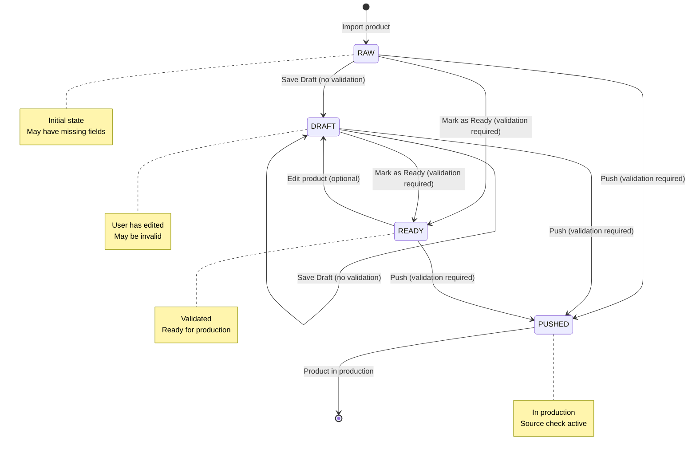

# State Machine

Product lifecycle, state transitions, and validation gates.

## Table of Contents

- [Product Lifecycle](#product-lifecycle)
- [State Definitions](#state-definitions)
- [Transition Rules](#transition-rules)
- [Validation Gates](#validation-gates)
- [Orthogonal States](#orthogonal-states)
- [State Diagram](#state-diagram)

---

## Product Lifecycle

Products move through a linear lifecycle with validation gates:

```
RAW → DRAFT → READY → PUSHED
```

### State Flow

1. **RAW**: Initial state after import
2. **DRAFT**: User has saved changes (may be invalid)
3. **READY**: Product is validated and ready for production
4. **PUSHED**: Product is in production database

**Note:** Products can skip states (e.g., RAW → PUSHED if valid).

---

## State Definitions

### RAW

**Initial State:** Yes  
**Validation Required:** No  
**Can Push:** Yes (if valid)  
**Can Edit:** Yes

**Description:**
- Product just imported from source store
- No user edits yet
- May have missing fields (brand, description, images)
- Default status for all imported products

**File:** `lib/fake-data.ts` - Products created with `status: "RAW"`

### DRAFT

**Initial State:** No  
**Validation Required:** No  
**Can Push:** Yes (if valid)  
**Can Edit:** Yes

**Description:**
- User has made edits and saved
- Product may or may not be valid
- Can be edited further
- Can be pushed directly if valid

**Transition From:**
- RAW (via "Save Draft" action)
- READY (if user edits after marking ready)

**File:** `lib/store.ts` - `updateProductStatus(id, "DRAFT")`

### READY

**Initial State:** No  
**Validation Required:** Yes  
**Can Push:** Yes  
**Can Edit:** Yes

**Description:**
- Product has been validated
- All required fields are present
- Ready to be pushed to production
- User can still edit (reverts to DRAFT)

**Transition From:**
- RAW (via "Mark as Ready" - requires validation)
- DRAFT (via "Mark as Ready" - requires validation)

**File:** `app/import/new/[id]/page.tsx` - `handleMarkReady()`

### PUSHED

**Initial State:** No  
**Validation Required:** Yes  
**Can Push:** No (already pushed)  
**Can Edit:** Yes (but unusual)

**Description:**
- Product is in production database
- Source check fields initialized
- Visible on storefront (if `visibility === "public"`)
- Can be monitored for source changes

**Transition From:**
- RAW (via "Push" - requires validation)
- DRAFT (via "Push" - requires validation)
- READY (via "Push")

**File:** `lib/store.ts` - `updateProductStatus(id, "PUSHED")` initializes source check fields

---

## Transition Rules

### RAW → DRAFT

**Trigger:** User action "Save Draft"  
**Validation:** Not required  
**Implementation:**
```typescript
updateProductStatus(id, "DRAFT")
```

**File:** `app/import/new/page.tsx` - `handleSaveDraft()`

### RAW → READY

**Trigger:** User action "Mark as Ready"  
**Validation:** Required (must pass all rules)  
**Implementation:**
```typescript
const validation = validateProduct(product)
if (!validation.isValid) {
  // Show error, block transition
  return
}
updateProductStatus(id, "READY")
```

**File:** `app/import/new/[id]/page.tsx` - `handleMarkReady()`

### RAW → PUSHED

**Trigger:** User action "Push"  
**Validation:** Required (must pass all rules)  
**Implementation:**
```typescript
const validation = validateProduct(product)
if (!validation.isValid) {
  // Show error, block transition
  return
}
updateProductStatus(id, "PUSHED")
// Initializes source check fields
```

**File:** `app/import/new/[id]/page.tsx` - `handlePush()`

### DRAFT → READY

**Trigger:** User action "Mark as Ready"  
**Validation:** Required (must pass all rules)  
**Implementation:** Same as RAW → READY

### DRAFT → PUSHED

**Trigger:** User action "Push"  
**Validation:** Required (must pass all rules)  
**Implementation:** Same as RAW → PUSHED

### READY → PUSHED

**Trigger:** User action "Push"  
**Validation:** Required (but should already be valid)  
**Implementation:** Same as RAW → PUSHED

### READY → DRAFT

**Trigger:** User edits product after marking ready  
**Validation:** Not required  
**Implementation:**
```typescript
// User edits field
handleFieldChange(field, value)
// Status remains READY until save
// On save, if edited: status → DRAFT
```

**Note:** Current implementation doesn't auto-revert to DRAFT on edit. This could be added.

### Any State → DRAFT

**Trigger:** User action "Save Draft"  
**Validation:** Not required  
**Implementation:**
```typescript
updateProductStatus(id, "DRAFT")
```

---

## Validation Gates

### Validation Rules

Products must pass all rules to transition to READY or PUSHED:

1. **nameMn**: Must not be empty (after trim)
2. **descriptionMn**: Must not be empty (after trim)
3. **priceMnt**: Must be > 0
4. **imagesFinal**: Must have at least 1 URL

**File:** `lib/store.ts` - `validateProduct()`

### Validation Implementation

```typescript
validateProduct(product: Product): ValidationResult {
  const errors: { field: string; message: string }[] = []

  if (!product.nameMn || product.nameMn.trim() === "") {
    errors.push({ field: "nameMn", message: "Mongolian name is required" })
  }

  if (!product.descriptionMn || product.descriptionMn.trim() === "") {
    errors.push({
      field: "descriptionMn",
      message: "Mongolian description is required",
    })
  }

  if (!product.priceMnt || product.priceMnt <= 0) {
    errors.push({
      field: "priceMnt",
      message: "Price must be greater than 0",
    })
  }

  if (!product.imagesFinal || product.imagesFinal.length === 0) {
    errors.push({
      field: "imagesFinal",
      message: "At least one image is required",
    })
  }

  return {
    isValid: errors.length === 0,
    errors,
  }
}
```

### UI Validation Feedback

**Editor Page:**
- Inline errors below each field
- Summary card at top if errors exist
- Action buttons disabled if invalid

**Bulk Push:**
- Validates all selected products
- Shows toast with count of invalid products
- Only pushes valid products

---

## Orthogonal States

These states are independent of the main lifecycle:

### Visibility

**States:** `"public"` | `"hidden"`

**Behavior:**
- Orthogonal to lifecycle status
- Can be toggled at any time
- Affects storefront visibility only
- Default: `"public"`

**Transition:**
- Toggle via UI button
- No validation required
- Immediate effect

**File:** `lib/store.ts` - `toggleVisibility()`

### Source Change Flags

**Flags:**
- `sourcePriceChanged`: Boolean
- `sourceOutOfStock`: Boolean

**Behavior:**
- Set by source check job
- Independent of lifecycle
- Only relevant for PUSHED products
- Used for filtering and alerts

**Initialization (on Push):**
```typescript
sourcePriceChanged = false
sourceOutOfStock = false
```

**Update (on Source Check):**
```typescript
sourcePriceChanged = (newPrice !== baselinePrice)
sourceOutOfStock = !inStock
```

**File:** `lib/store.ts` - `runSourceCheckForPushedProducts()`

---

## State Diagram



---

## State Transition Matrix

| From | To | Trigger | Validation | Can Skip |
|------|-----|---------|------------|----------|
| RAW | DRAFT | Save Draft | No | No |
| RAW | READY | Mark as Ready | Yes | No |
| RAW | PUSHED | Push | Yes | Yes |
| DRAFT | DRAFT | Save Draft | No | N/A |
| DRAFT | READY | Mark as Ready | Yes | No |
| DRAFT | PUSHED | Push | Yes | Yes |
| READY | PUSHED | Push | Yes | No |
| READY | DRAFT | Edit (optional) | No | N/A |
| Any | DRAFT | Save Draft | No | N/A |

**Can Skip:** Whether intermediate states can be bypassed (e.g., RAW → PUSHED directly).

---

## Bulk State Transitions

### Bulk Save Draft

**Action:** Select multiple products → "Save Draft (Bulk)"  
**Transition:** All selected → DRAFT  
**Validation:** Not required  
**Behavior:** All or nothing (all selected products transition)

**File:** `app/import/new/page.tsx` - `handleBulkSaveDraft()`

### Bulk Push

**Action:** Select multiple products → "Push (Bulk)"  
**Transition:** All valid selected → PUSHED  
**Validation:** Required (per product)  
**Behavior:** 
- Validates all selected products
- Only pushes valid products
- Shows error toast if any invalid

**File:** `app/import/new/page.tsx` - `handleBulkPush()`

---

## Production Considerations

### State Persistence

**MVP:** localStorage via Zustand persist  
**Production:** Database with status column

### State History (Future)

Track state transitions for audit:
```sql
CREATE TABLE product_state_history (
  id UUID PRIMARY KEY,
  product_id VARCHAR(255) REFERENCES products(id),
  from_status VARCHAR(20),
  to_status VARCHAR(20),
  user_id UUID,
  created_at TIMESTAMP WITH TIME ZONE
);
```

### State Locking (Future)

Prevent concurrent edits:
- Lock product when user opens editor
- Release lock on save/close
- Show warning if another user is editing

---

## File Reference

- State Logic: `lib/store.ts`
- Validation: `lib/store.ts` - `validateProduct()`
- UI Actions: `app/import/new/page.tsx`, `app/import/new/[id]/page.tsx`
- Types: `types/product.ts`

